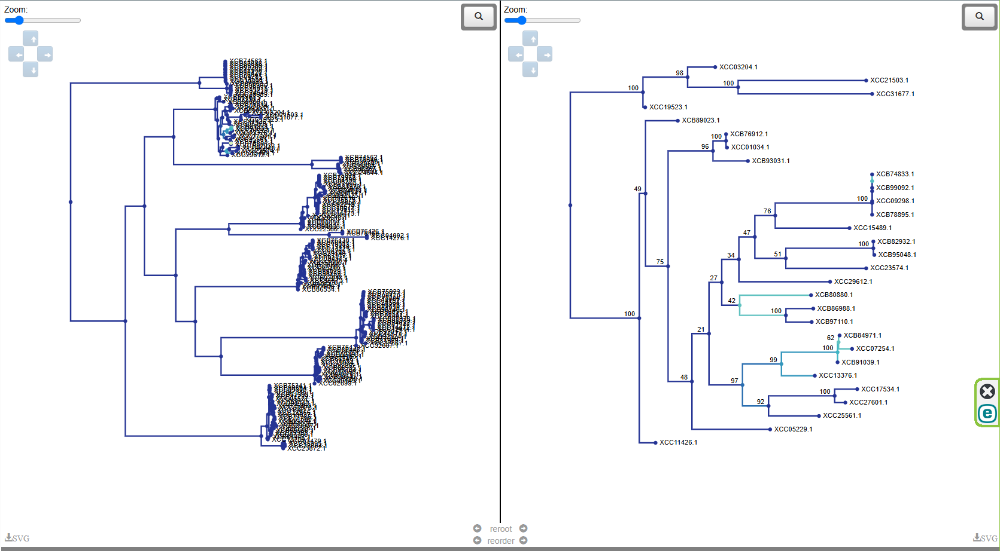

## STEP 1. Get data
downloading using [webinterface](https://www.ncbi.nlm.nih.gov/datasets/genome/?taxon=485&annotated_only=true&genbank_annotation=true&search_text=WHO&assembly_level=2:3&release_year=2022:2025)   
filters:    
✔ Neisseria gonorrhoeae (taxon 485)   
✔ Annotated genomes only   
✔ GenBank assemblies (GCA_)   
✔ Chromosome and complete levels   
✔ Released after 2022   
✔ Search for "WHO" in metadata   
✔ proteomes as well as the genomic feature file   

## Step 2. Extarct core orthologous 
Work with pipeline suggested by [proteinortho](https://gitlab.com/paulklemm_PHD/proteinortho/-/wikis/synteny-example) until step 5  
```
The PoFF extension allows us to use the relative order of genes (synteny)
as an additional criterion to disentangle complex co-orthology relations.
To do so, add the parameter -synteny.
We can use it to either come closer
to one-to-one orthology relations by preferring synthetically conserved
copies in the presence of two very similar paralogs (default), or just to
reduce noise in the predictions by detecting multiple copies of genomic
areas 
```
main commands:  
`proteinortho -cov=90 -e=1e-10 -synteny *faa`   
`proteinortho_grab_proteins.pl -core myproject.poff.tsv *faa`


What is in [myproject.poff.tsv](<myproject.poff.tsv>) (Main file) — the main output of proteinortho with --synteny. Contains:

Groups of orthologous genes (genes that are similar between different organisms).
Conserved gene orders (synteny) → genes that are not only similar, but also located near each other in different genomes.

The first three columns in the file contain metadata:

    # Species – the number of species for which orthologs were found.

    Genes – the total number of proteins (genes) in the orthogroup.

    Alg.-Conn. – the "algebraic connectivity" value, showing how related the group is (the proximity of orthologs to each other). The closer the value is to 1, the higher the confidence that the proteins are orthologs.
    
    The remaining columns are protein identifiers for each sample.

`for f in *core; do echo $f; grep ">" $f | wc -l; done`
> 1576 

Meaning that we ve got 1576 core orthogroups finally.

## Step 3. Working with tsv and core files 

Parse the tsv file obtained after proteinortho.
Orthologous groups are selected where the number of species (# Species) and the number of genes (Genes) coincide with the number of samples used, and the parameter "Alg.-Conn." is not taken into account. For each such orthogroup, extract proteins from core files (using indices). Make a mafft alignment. Evaluate the variability of the orthogroup using the Shannon index.

We will use python script for that - [align+shannon.py](<align+shannon.py>)

Firstly create this kind of structure:
```
.
├── align+shannon.py
├── core_files/
│   ├── GCA_XXXX_protein.faa.core
│   ├── GCA_YYYY_protein.faa.core
│   └──  etc.
├── myproject.poff.tsv
```


As an output of our py script we got: Alignments (in fasta format) of each orthogroup. The shannon_indices.tsv file with the Shannon index for each orthogroup.

Let's look at the head of the file shannon_indices.tsv:

```
Orthogroup      ShannonIndex
56      0.0004
57      0.0000
58      0.0000
59      0.0034
60      0.0436
61      0.0112
62      0.0042
63      0.0111
64      0.0020
```
Full Summary Stats (Mean, Median, Min, Max, Std Dev):
```
awk '
NR > 1 {
    sum += $2; 
    vals[NR] = $2; 
    if ($2 > max || NR == 2) max = $2; 
    if ($2 < min || NR == 2) min = $2; 
} 
END { 
    mean = sum / (NR - 1); 
    asort(vals); 
    median = (NR % 2 == 0) ? (vals[int(NR/2)] + vals[int(NR/2)+1]) / 2 : vals[int(NR/2)+1]; 
    for (i in vals) { sum_sq += (vals[i] - mean)^2 } 
    stdev = sqrt(sum_sq / (NR - 1)); 
    print "Mean:", mean; 
    print "Median:", median; 
    print "Min:", min; 
    print "Max:", max; 
    print "Std Dev:", stdev; 
}' shannon_indices.tsv
```
Mean: 0.0090826
Median: 0.0032
Min: 0.0000
Max: 0.5428
Std Dev: 0.0288154

In that case for future analysis we will filter orthogroups fith highest Shannon index, filtering those with Mean + 3 × Std Dev ≈ 0.0090826 + (3 × 0.0288154) ≈ 0.0955

Make another simple python [script](shannon_filt.ipynb) - Reads data from the file shannon_indices.tsv. Calculates and displays general statistics. Applies a filter (Mean + 3 × Std Dev) to the Shannon index values. Saves the filtered data to the file [shannon_indices_filt.tsv.](shannon_indices_filt.tsv):

```
Orthogroup      ShannonIndex
140     0.1168
284     0.2375
285     0.3004
286     0.1374
294     0.2408
295     0.1757
408     0.1705
445     0.1271
608     0.2558
851     0.5428
````

## Step 4. Aligning and tree-ing

Pre Requirements - MAFFT. IQ-TREE.   
Procedure:
- Sort orthogroups by descending Shannon index.
- Then take the first orthogroup (with the highest index), add the second, third, etc.

At each iteration:

- Align the sequences of the selected orthogroups using MAFFT.
- Build a bootstrap tree using IQ-TREE.

Next step: Compare the resulting trees between iterations to see if the clades have stabilized.

apply script [tree_filt.py]() that takes as an input "shannon_indices.tsv" filter it and make trees with increasing number od orthogroups 

After 9 trees become time consuming = all-in-all takes 8 hours.
 IQ-TREE output gives us number of files. Let's have a look on the first and very last of our analyses (treefile in newick format) [aligned_1.faa.treefile]() [ligned_9.faa.treefile]()

  represent on the left handside 9orthogroup tree, on the right handside - 1orthogroup tree using [phylo.io](https://phylo.io/)  
 